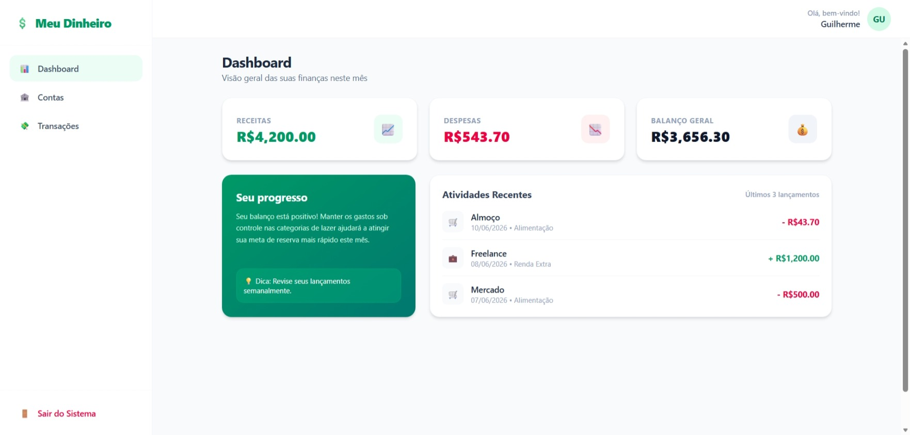
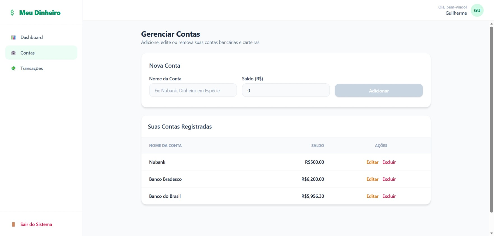
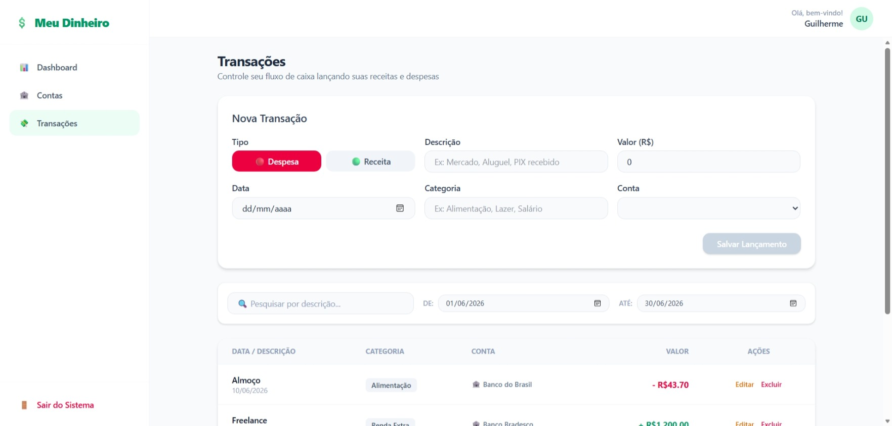
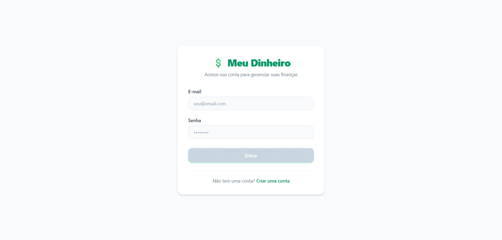

# Personal Finance Web 📊

A sleek, responsive, and modern web interface designed for the personal finance management ecosystem. Built with Angular, this application provides a highly reactive user experience, asynchronously consuming a secure RESTful API while robustly managing user authentication and state.


### 🖼️ Preview

<table>
  <tr>
    <td align="center"><strong>Dashboard</strong></td>
    <td align="center"><strong>Accounts</strong></td>
  </tr>
  <tr>
    <td></td>
    <td></td>
  </tr>
  <tr>
    <td align="center"><strong>Transactions</strong></td>
    <td align="center"><strong>Login</strong></td>
  </tr>
  <tr>
    <td></td>
    <td></td>
  </tr>
</table>

---

## 🚀 Technologies Used

* **Angular 22** (Utilizing modern Standalone Components and Signals)
* **TypeScript** (Strictly typed code for reliable development)
* **RxJS** (Reactive programming for handling asynchronous API data streams)
* **TailwindCSS** (A utility-first CSS framework to build the design, directly in the markup)
* **Docker & Docker Compose** (Containerization and ecosystem orchestration)

---

## 🔑 Frontend Technical Highlights

* **Functional HttpInterceptor:** A centralized, global interceptor captures all outgoing HTTP requests, automatically retrieving the JWT token from `localStorage` and injecting the `Authorization: Bearer <TOKEN>` header.
* **Route Guards (AuthGuard):** Navigation security that protects private routes (like `/dashboard` and `/transactions`). Unauthenticated users are automatically intercepted and redirected to the `/login` screen.
* **State & Reactive Architecture:** Complete separation of concerns. Smart components handle data streaming via services, while dummy components focus purely on rendering the financial UI layout.
* **UX/UI Best Practices:** Implements dynamic loading indicators, clean error feedback handling for failed API requests, and proper form state management with Angular Reactive Forms.

---

## 📦 How to Run

### Prerequisites
* Node.js (v18 or higher) and npm installed.

### Local Installation Steps

1. **Clone the repository and navigate to the folder:**
   ```bash
   cd personal-finance-web
   ```

2. **Install the dependencies:**
   ```bash
   npm install
   ```

3. **Configure the API endpoint:**
* Open the src/app/assets/env.js file and ensure the API URL points to your running backend:
   ```js
   window.env = {
      apiUrl: "http://localhost:8080"
   };
   ```

4. **Run the development server:**
   ```bash
   npm start
   ```

The application will be up and running at http://localhost:4200 🚀.

## 🐳 Running with Docker (Ecosystem Integration)

This frontend contains a production-ready `Dockerfile` (using a multi-stage build with Node.js and an Nginx alpine server to serve the static files efficiently).

Instead of running it manually, you can spin up the **entire ecosystem** (Frontend, Backend, and Database) at once. Navigate to the directory where your main `docker-compose.yml` is located and execute:

Clone the projects, keeping them in the following structure. The docker-compose.yml file will look for the personal-finance-web folder one level above the backend folder.

```sh
mkdir personal-finance-app
cd personal-finance-app
git clone https://github.com/GuilhermeRBLC/personal-finance-api.git
git clone https://github.com/GuilhermeRBLC/personal-finance-web.git
```

```bash
📁 personal-finance-app/              # Root Directory
├── 📁 personal-finance-api/          # ☕ BACKEND (Spring Boot API)
│    └── 📄 docker-compose.yml        # 🐳 Ecosystem Orchestrator (Database + Back + Front)
└── 📁 personal-finance-web/          # 🅰️ FRONTEND (Angular Web App)
```

```bash
docker-compose up -d --build
```
The frontend container will build, compile the Angular application, and expose the interface at http://localhost (or http://localhost:4200 depending on your compose configuration) 🚀.

To stop everything.

```bash
docker-compose down
```
